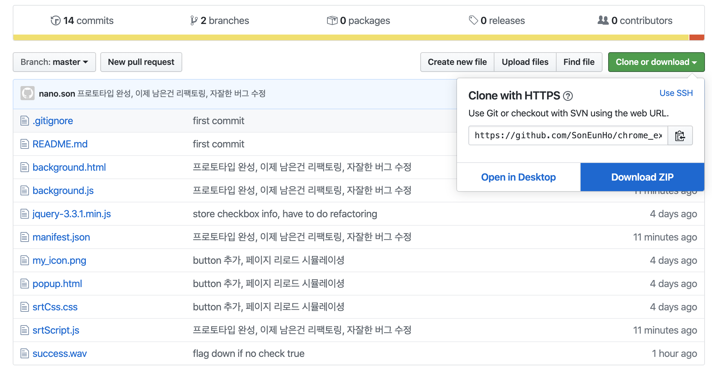
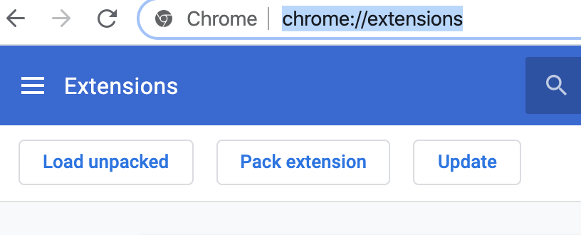
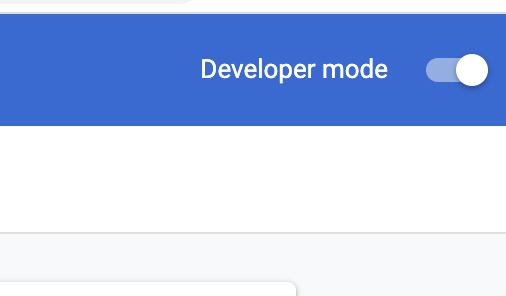
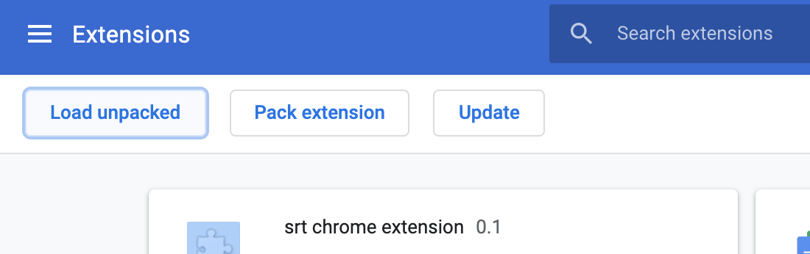
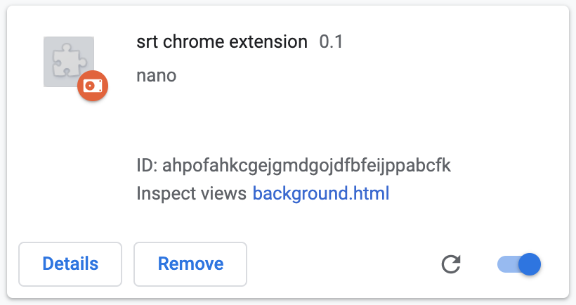
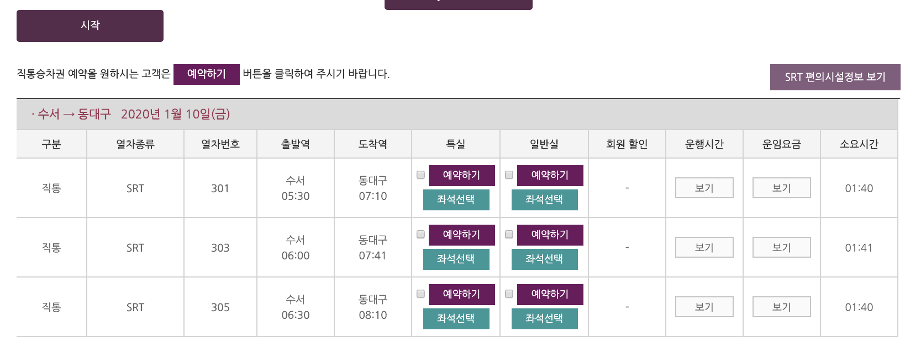

## srt chrome extension

#### 기차 예매를 도와주는 목적으로 만들었습니다. (공부 목적이었음. 그렇다고 잘 짠 코드는 아님)

### 1. 소스 디렉토리를 다운로드합니다.

### 2. 크롬 익스텐션 관리페이지를 엽니다.
chrome://extensions/
위 주소를 복사해서 크롬 주소창에 붙여넣으세요.

### 3. Developer mode를 활성화 합니다.

### 4. Load unpacked 버튼을 클릭해서 다운받은 폴더를 첨부합니다.

### 5. 잘 로딩됐는지 확인합니다. 우측 하단의 활성화 버튼이 켜져있는지 확인합니다.

### 6. 승차권 예약 페이지에서 사용하면 됩니다.
